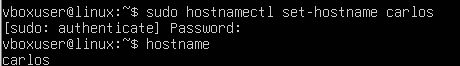
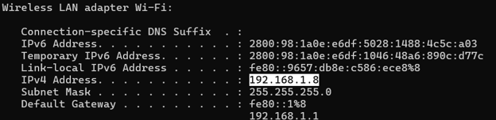
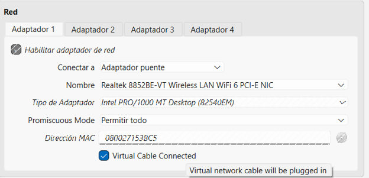
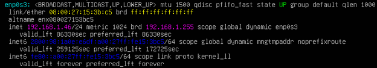
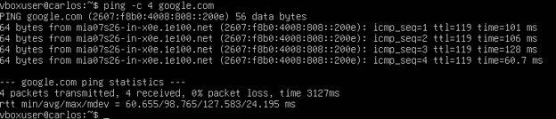
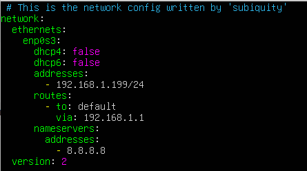
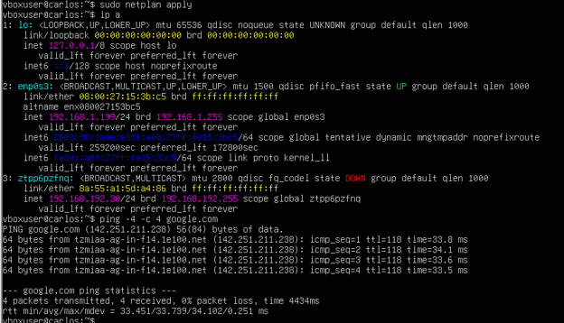
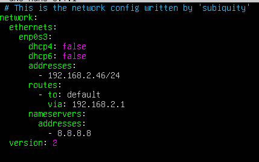
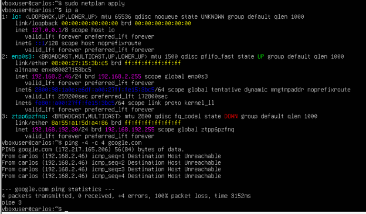

# HW-03 - Configuración de modos de red

## 1. Hostname

Se configuró el hostname de la máquina virtual utilizando mi nombre.

## 2. Subred del hipervisor

La subred utilizada por el hipervisor (laptop) se obtuvo mediante el comando `ipconfig`, para poder comparar contra las IPs asignadas a la VM.

## 3. Bridge - IP obtenida por DHCP

La máquina virtual fue configurada en modo Bridge.

 Obteniendo su dirección IP automáticamente mediante DHCP dentro de la subred del hipervisor.

## 4. Bridge - IP manual dentro de la subred

Se configuró manualmente una dirección IP perteneciente a la misma subred del hipervisor.

[CAPTURA]

## 5. Bridge - IP manual fuera de la subred

Se configuró manualmente una dirección IP (192.168.2.46/24) perteneciente a una subred diferente a la del hipervisor (192.168.1.0/24).

Al forzar el ping por IPv4 con `ping -4`, se obtuvo "Destination Host Unreachable", ya que la IP fuera de subred no tiene ruta válida hacia el gateway (192.168.1.1):

## Conclusión

Se realizaron las tres configuraciones solicitadas en modo Bridge, comprobando mediante `ping` el comportamiento de la conexión en cada escenario. Un hallazgo relevante fue que, al tener la VM conectividad IPv6 global además de IPv4, los pings por defecto pueden salir por IPv6 y ocultar problemas de ruteo IPv4 — por lo que en el escenario 5 se verificó explícitamente el comportamiento con `ping -4`, confirmando que la IP configurada manente fuera de subred no tiene ruta de salida por IPv4.