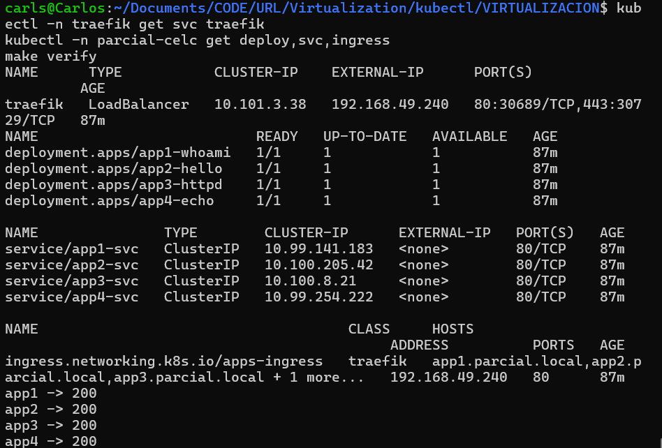

# Evaluación Parcial II: Kubernetes, Traefik y MetalLB

Cuatro aplicaciones web expuestas por **una única IP** (`192.168.49.240`) en un clúster local de **Minikube**. **MetalLB** asigna la IP del LoadBalancer, **Traefik** actúa como Ingress Controller y enruta por nombre de dominio. Toda la infraestructura está definida como código (YAML, values de Helm y Makefile).

- **Rama:** `assessment-02`
- **Namespace de las apps:** `parcial-celc`
- **Dominios:** `app1.parcial.local` ... `app4.parcial.local`

## Arquitectura

```
Navegador ──► /etc/hosts ──► 192.168.49.240 (IP de MetalLB)
                                   │
                    Service traefik (LoadBalancer, ns: traefik)
                                   │
                         Traefik (enruta por Host)
                                   │
                  Ingress apps-ingress (ns: parcial-celc)
                                   │
                  appN-svc ──► Deployment appN (2 réplicas)
```

## Estructura del IaC

```
.
├── Makefile                        # punto de entrada del despliegue
├── metallb/metallb-config.yaml     # IPAddressPool + L2Advertisement
├── traefik/values.yaml             # Helm values (Service LoadBalancer)
├── apps/apps.yaml                  # Namespace, 4 Deployments, 4 Services, Ingress
├── scripts/hosts.sh                # DNS local en /etc/hosts
├── bridge/docker-compose.yaml      # opcional: acceso desde Windows
└── screenshots/
```

| Requisito | Dónde se cumple |
|---|---|
| MetalLB en su propio namespace, con una sola IP | `metallb-system` · `metallb/metallb-config.yaml` |
| Traefik en su propio namespace, Service `LoadBalancer` con la IP de MetalLB | `traefik` · `traefik/values.yaml` |
| 4 Deployments y 4 Services en `parcial-celc` | `apps/apps.yaml` |
| Services gestionados por Traefik | `Ingress` con `ingressClassName: traefik` en `apps/apps.yaml` |
| 4 dominios apuntando a la IP del LoadBalancer | `scripts/hosts.sh` |

## Requisitos

Entorno usado: Windows + WSL2 (Ubuntu 24.04), Docker Engine, Minikube con driver `docker`, `kubectl` y `helm`.

> Completar versiones: `minikube version`, `kubectl version --client`, `helm version`.

## Despliegue

```bash
minikube start
make
```

`make` ejecuta en orden:

| Regla | Qué hace |
|---|---|
| `metallb` | Instala MetalLB v0.14.9 y aplica el pool de una sola IP |
| `traefik` | Instala Traefik con Helm usando `traefik/values.yaml` |
| `apps` | Despliega las 4 aplicaciones, sus Services y el Ingress |
| `route` | Ruta local hacia la IP de MetalLB (ver nota WSL) |
| `hosts` | Agrega los 4 dominios a `/etc/hosts` |
| `verify` | Comprueba que los 4 dominios respondan `200` |

## Configuración

**MetalLB.** El `IPAddressPool` contiene una única IP, `192.168.49.240`, dentro de la subred de Minikube, anunciada mediante `L2Advertisement`.

**Traefik.** El Service es de tipo `LoadBalancer` y solicita la IP de MetalLB con la anotación `metallb.io/loadBalancerIPs`.

**Aplicaciones.** Cada una tiene 2 réplicas, probes de readiness y liveness, límites de recursos y un Service `ClusterIP`.

| App | Imagen | Service | Dominio |
|---|---|---|---|
| app1 | `traefik/whoami` | `app1-svc` | `app1.parcial.local` |
| app2 | `nginxdemos/hello` | `app2-svc` | `app2.parcial.local` |
| app3 | `httpd:2.4` | `app3-svc` | `app3.parcial.local` |
| app4 | `hashicorp/http-echo` | `app4-svc` | `app4.parcial.local` |

**DNS local.** `scripts/hosts.sh` agrega, de forma idempotente, estas entradas a `/etc/hosts`:

```
192.168.49.240 app1.parcial.local
192.168.49.240 app2.parcial.local
192.168.49.240 app3.parcial.local
192.168.49.240 app4.parcial.local
```

**Nota WSL2.** Desde WSL no se recibía respuesta ARP de MetalLB, por lo que la regla `route` agrega una ruta hacia la IP del LoadBalancer a través del nodo de Minikube. La ruta se pierde al reiniciar WSL; basta con ejecutar `make route` de nuevo.

## Verificación

```bash
kubectl -n traefik get svc traefik
kubectl -n parcial-celc get deploy,svc,ingress
make verify
```

```

```

### Capturas

| | |
|---|---|
|  |  |
|  |  |

## Acceso desde Windows (opcional)

Windows no ve la red de Minikube, que existe solo dentro de WSL. Para abrir las apps en el navegador de Windows, `make bridge` levanta un contenedor `socat` que reenvía `localhost:80` a la IP de MetalLB, y el archivo hosts de Windows apunta los 4 dominios a `127.0.0.1`. El tráfico sigue pasando por MetalLB y Traefik. Este paso solo sirve para visualizar las apps; la configuración evaluada es la de `/etc/hosts` en WSL.

## Limpieza

```bash
make clean
sudo sed -i '/parcial\.local/d' /etc/hosts
```