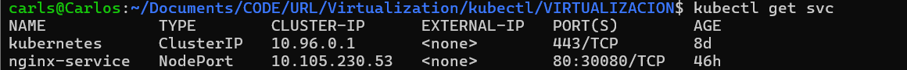
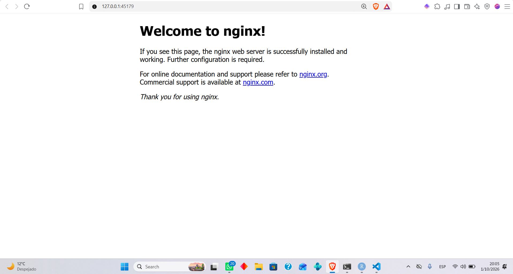

## Nginx en Kubernetes

Esta tarea contiene la configuración de un servidor Nginx desplegado en Kubernetes mediante Minikube.

### Despliegue

Aplicar la configuración:

```bash
kubectl apply -f enginx-deploiment.yaml
```

Verificar los pods:

```bash
kubectl get pods
```

Verificar el servicio:

```bash
kubectl get svc
```


### Acceso mediante Minikube

Para acceder al servicio:

```bash
minikube service nginx-service --url
```


El comando proporciona una URL local para acceder al servidor Nginx desde el navegador.

### Arquitectura

```text
Minikube
   │
   └── Service: nginx-service
          │
          └── Deployment: nginx-deployment
                 ├── Nginx Pod 1
                 ├── Nginx Pod 2
                 └── Nginx Pod 3
```
