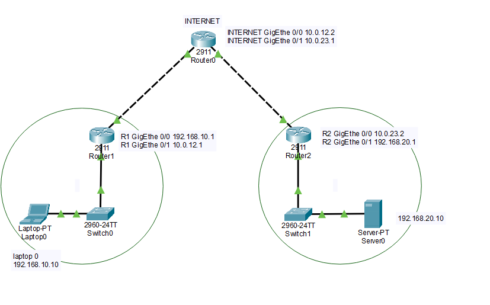
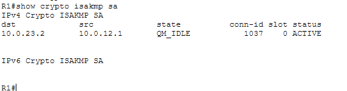
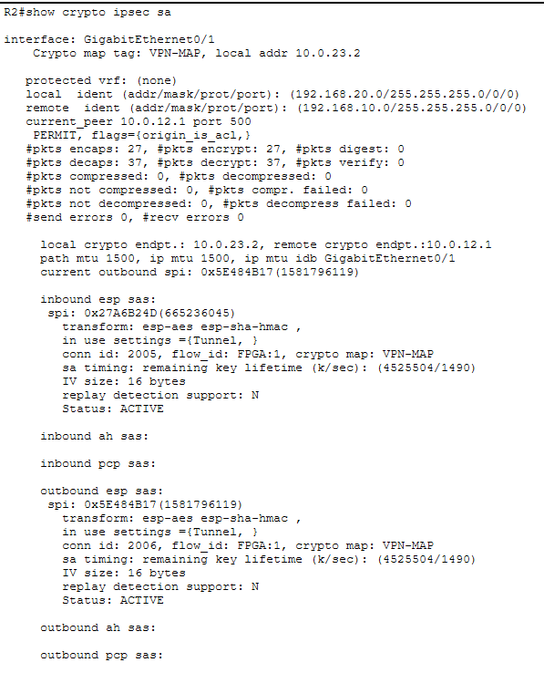
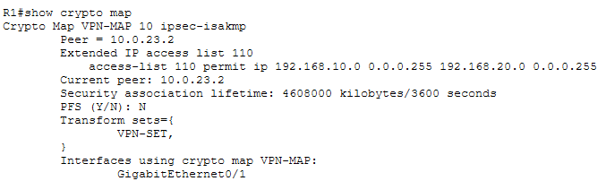
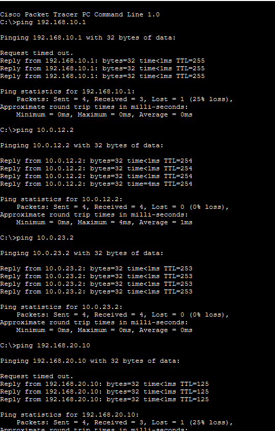
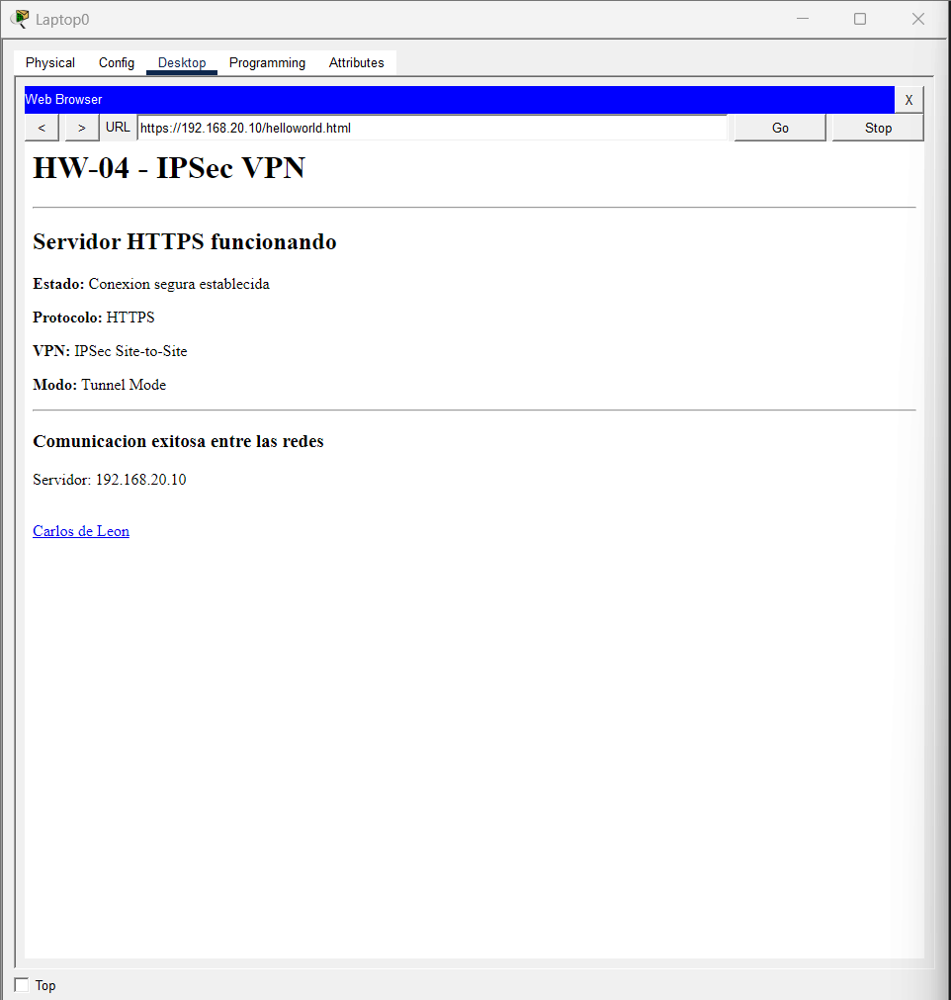

# Tarea 04 - IPSec

## Descripción

VPN IPSec Site-to-Site entre dos redes distintas, usando un router intermedio para simular Internet. Permite la comunicación segura entre una PC en la red `192.168.1.0/24` y un servidor en la red `192.168.2.0/24`, protegiendo el tráfico mediante IPSec en modo túnel. El servidor remoto expone un servicio web accesible desde la red opuesta.

---

## Topología

`PC0 → Router1 → RouterInternet → Router2 → Server0`

| Dispositivo / Red | Dirección |
|---|---|
| Red LAN 1 | 192.168.1.0/24 |
| PC0 | 192.168.1.10 |
| Gateway LAN 1 | 192.168.1.1 |
| Router1 WAN | 200.1.1.1 |
| Router2 WAN | 200.2.2.2 |
| Red LAN 2 | 192.168.2.0/24 |
| Server0 | 192.168.2.10 |
| Gateway LAN 2 | 192.168.2.1 |

---

## Configuración IPSec

- IKE/ISAKMP con Pre-Shared Key
- Cifrado AES-256 para IKE, Diffie-Hellman Group 5
- Transform Set: ESP con 3DES + autenticación SHA-HMAC
- Modo Tunnel, Crypto Map en interfaces WAN
- ACL para el tráfico entre `192.168.1.0/24` y `192.168.2.0/24`

---

## Verificación

**Router1 / Router2** — estado de la conexión IPSec:

**Crypto Map** — peer remoto, Transform Set y ACL aplicados en ambas WAN:

**Conectividad** — ping exitoso entre `192.168.1.10` y `192.168.2.10`:

**Cifrado IPSec** — con `show crypto isakmp sa` y `show crypto ipsec sa`, los contadores `#pkts encaps/encrypt/decaps/decrypt` mostraron valores mayores a cero, confirmando el cifrado y descifrado del tráfico.

---

## Servicio web

Desde PC0 se accede al servicio web de `Server0` (`192.168.2.10`), protegido por el túnel IPSec:

---

## Flujo de comunicación

PC0 (192.168.1.10)
→ Router1 (192.168.1.1 / 200.1.1.1)
→ IPSec Tunnel → RouterInternet →
→ Router2 (200.2.2.2 / 192.168.2.1)
→ Server0 (192.168.2.10)

Router1 cifra el tráfico que coincide con la ACL antes de enviarlo hacia Internet; Router2 lo descifra y lo entrega a Server0. Las respuestas siguen el camino inverso.

---

## Resultado

Se estableció correctamente la VPN IPSec Site-to-Site entre Router1 y Router2, en modo Tunnel, confirmando cifrado/descifrado mediante los contadores IPSec y logrando comunicación web exitosa entre `192.168.1.0/24` y `192.168.2.0/24`.

